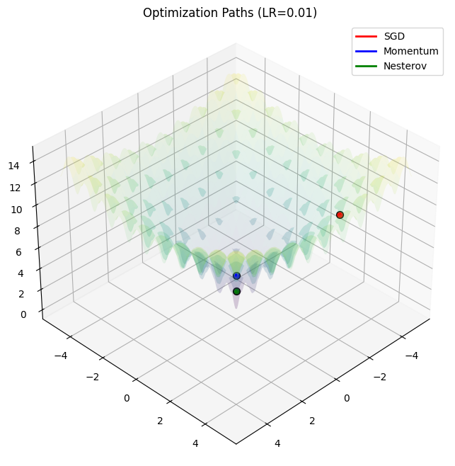

# OptiBall 📉☄️

**OptiBall** is a visual exploration of how different optimization algorithms—the "marbles" of machine learning—behave when dropped into complex mathematical terrains. 



Starting from the foundations of **Andrej Karpathy's `micrograd`**, I built a custom autograd engine from scratch and used it to simulate how **Vanilla SGD**, **Momentum**, and **Nesterov Accelerated Gradient (NAG)** navigate the notorious **Ackley Function**.


## 🧠 Why this project?
In deep learning, we often treat optimizers like `Adam` or `SGD` as black boxes. This project breaks that box open. By implementing the math from first principles, I discovered that optimization isn't just about "learning", it's about the physics of motion, energy, and landscape geometry.

## 🚀 Key Insights
* **Initialization is Destiny:** An optimizer is only as good as its starting point. In non-convex landscapes like the Ackley function, starting in a "bad neighborhood" means getting trapped in a local minimum, regardless of how advanced the algorithm is.
* **The Momentum Slingshot:** While Momentum helps escape small ridges, it can also lead to "overshooting" where the marble gains too much kinetic energy and launches out of the global minimum.
* **Nesterov’s "Look-Ahead":** NAG acts like a scout. By calculating the gradient at a predicted future position, it can dampen its speed before hitting a "wall," leading to more stable convergence than standard momentum.


## 🛠️ Project Structure
* `engine.py`: A lightweight scalar-valued autograd engine (inspired by `micrograd`).
* `main.py`: The simulation logic, including the Ackley function implementation and the 3D plotting engine.
* `optiball_demo.ipynb`: A Google Colab-ready notebook for interactive experimentation.

## 📊 Visualizing the "Physics"
The visualization uses a "lifted Z-axis" approach to prevent clipping between the surface and the trajectories. By calculating heights using NumPy for the surface and the custom `Value` class for the paths, we get a high-fidelity look at the optimization process.


## ⚙️ How to Run
1. **Clone the repo:**
   ```bash
   git clone [https://github.com/harshpailkar/OptiBall.git](https://github.com/harshpailkar/OptiBall.git)

2. **Install dependencies:**
   ```bash
   pip install numpy matplotlib

3. **Run the simulation:**
   ```bash
   python main.py
